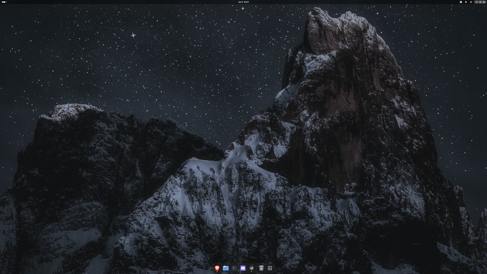

# EOS-Setup

A list of all the configuration changes I do to make the perfect gaming/work setup for EndeavourOS.

<br>



<br>
<br>

# Drivers

### Official Nvidia Drivers
<https://discovery.endeavouros.com/nvidia/new-nvidia-driver-installer-nvidia-inst/2022/03/>  
<br>
This CLI will automatically install the latest Nvidia drivers for your EOS installation.

```
nvidia-inst
```  

<br>

### Installing envycontrol  
<https://discovery.endeavouros.com/hardware/envy-control/2023/03/>  
<br>
This CLI will install envycontrol which allows you to configure Nvidia optimus profiles  

```
yay -S envycontrol
```  

Then once installed you can configure the Nvidia profile using the following CLI  

```
sudo envycontrol -s <mode>
```  

The current mode options are `integrated`, `hybrid`, `nvidia`  
<br>
<br>
<br>


# Flatpak
### Link to Flathub
<https://flathub.org/en>

<br>

### Install Flatpak support
<https://flatpak.org/setup/EndeavourOS>  
<br>
This CLI will install flatpak

```
sudo pacman -S flatpak
```

Then we need to add Flathub repository  

```
flatpak remote-add --if-not-exists flathub https://flathub.org/repo/flathub.flatpakrepo
```

Finally we can update all Flatpaks using the following:

```
flatpak update
```

<br>
<br>
<br>

# Gaming Setup
### Installing Steam
The following CLI installs Steam
```
yay -S Steam
```
<br>

### Installing Mangohud for Performance Monitoring
This step will require you to install from the Aur repo as opposed to the official repo as it is borked on EOS
<https://github.com/flightlessmango/MangoHud>

```
yay -S mangohud-git
```
```
yay -S lib32-mangohud-git
```

You can configure mangohud by editing the following config at this location

`Home / .config / MangoHud / MangoHud.conf`

<br>

### Installing Protonup-qt
This tool will let you get the latest GE versions of Proton for additional proton support
```
yay -S protonup-qt
```

<br>

### Installing Gamemode
<https://wiki.archlinux.org/title/Gamemode>

First update your repositories
```
packman -Syy
```
These two cli's will install the gamemode libraries from Feral Interactive
```
packman -S lib32-gamemode
```
```
packman -S gamemode
```

<br>

### Enable Game Mode Scheduling
Game Mode configures the CPU governer, scheduler, and process niceness for maximum performance for games. 

<br>

First enable the multilib repo if you haven't already. Edit `/etc/pacman.conf` to add

```
[multilib]
Include = /etc/pacman.d/mirrorlist
```

Now you need to run the following cli in a terminal to create a new user group for gamemode

```
groupadd -r gamemode
```

Time to add yourself to the newly created gamemode group with the following

```
usermod -a yourUserName -G gamemode
```

If you are unsure of the user currently active you can type `who` into the terminal to see a list of users

Edit system security limits for users nano /etc/security/limits.conf and add the following to the bottom. This will enable user accounts that are members of the gamemode group to increase (or 'renice') processes up to a value of 10.

```
@gamemode       -       nice    10
```

<br>

Time to check if gamemode is setup correctly

The following command will test gamemode's setup on your system

```
gamemoded -t
```

You can also launch a game with the gamemode command and check the status of gamemode through the terminal with the following cli, Although I recommend using the Gnome plugin `Gamemode Indicator` in the Gnome extensions to see a little pop-up appear in the system tray when gamemode is currently active.

```
gamemoded -s
```

To launch a game in steam with gamemode simply put the following command in the Steam games properties

```
gamemoderun %command%
```


<br>
<br>
<br>

# Customising Desktop
### Wallpaper
<https://www.pexels.com/photo/mountain-peaks-during-night-time-3389618/> 

<br>

### Gnome Extensions

First install the extension manager from Aur
<br>

```
yay -S extension-manager
```
<br>
Now install the following extensions through Extension Manager:
<br>

`Dash to Dock`

`Blur My Shell`

`Desktop Cube`

`Coverflow Alt-Tab`

`AppIndicator and KStatusNotifierItem Support`

`gSnap`

`Gamemode Indicator`

<br>
<br>
<br>

# Linux Kernal Additional Information
### Configure Zen Kernel as default 
This CLI will open up the grub loader in Nano  

```
sudo nano /efi/loader/loader.conf
```  


Then change the content of the loader to include the kernel name as default  

```
default *zen.conf
timeout 5
console-mode auto
reboot-for-bitlocker 1
```  

You can also view the currently running kernel with the following CLI  

```
uname -r
```  

<br>
<br>
<br>

# Additional Optional Commands
### Download Gnome Software GUI package manager  
This CLI will install the Gnome Software App
```
sudo pacman -Syu gnome-software-packagekit-plugin gnome-software
```
<br>
<br>
<br>

